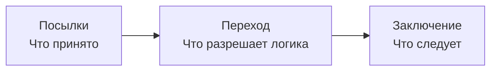

---
tags:
  - логика
  - обучение
lesson: 1
---

# 01. Что именно проверяет логика

Урок 1 из 12 · ориентир: 45–75 минут вместе с задачами.

[Оглавление](00-index.md) · [Урок 2](02-connectives.md) →

Предварительная подготовка не нужна.

После этого урока ты сможешь отделить ошибку рассуждения от ложной посылки. Для начала достаточно бумаги: программирование и специальные математические знания не нужны.

## В этом уроке

- [1. Утверждение, посылка, заключение](#раздел-1)
- [2. Истинность и правильность перехода](#раздел-2)
- [3. Почему правдоподобного объяснения мало](#раздел-3)
- [4. Дедукция, гипотеза и наблюдение](#раздел-4)
- [5. Как это связано с твоей системой](#раздел-5)
- [Задачи и самопроверка](#задачи-и-самопроверка)

## Раздел 1

### Утверждение, посылка, заключение

«Сборка прошла тесты» — утверждение: при фиксированных сборке, наборе тестов и времени оно может быть истинным или ложным. «Проверь сборку» — просьба, а «прошла ли сборка?» — вопрос. Вопрос можно исследовать средствами логики, но сам он не служит посылкой с истинностным значением.

**Аргумент** в логике — набор посылок и заключение, которое ими обосновывают. Например: «Все прошедшие проверку пакеты подписаны. Пакет Atlas прошёл проверку. Следовательно, Atlas подписан». Слово «следовательно» выражает претензию на логическую связь. Оно само эту связь не доказывает.

## Раздел 2

### Истинность и правильность перехода

Пусть P означает «Atlas прошёл проверку», а S — «Atlas подписан». Форма аргумента: P → S; P; значит, S. Переход корректен: нельзя одновременно принять обе посылки истинными и заключение ложным. Но в реальной системе правило P → S может оказаться неверным: например, подпись добавляют отдельным этапом.

Поэтому проверяются две вещи. **Валидность аргумента** означает сохранение истины от посылок к заключению. **Обоснованный аргумент в смысле sound argument** — валидный аргумент с истинными посылками. Позже термин soundness встретится ещё и как свойство всей системы доказательства; это другой уровень разговора.

*Логика проверяет переход относительно посылок; истинность посылок исследуют отдельно.*

## Раздел 3

### Почему правдоподобного объяснения мало

Рассмотрим обратный ход: «Если проверка пройдена, пакет подписан. Пакет подписан. Значит, проверка пройдена». Он неверен. Можно подписать пакет вручную, не проверяя. Получается ситуация, в которой обе посылки истинны, а заключение ложно. Такая ситуация называется **контрпримером к аргументу**.

Истинное заключение не спасает неверный переход. Atlas мог действительно пройти проверку, но подпись сама по себе этого не устанавливает. И наоборот: ложная посылка не делает форму перехода неверной. Пиши отдельно: «правило спорно» и «из правила это не следует».

## Раздел 4

### Дедукция, гипотеза и наблюдение

| Ход | Пример | Обязательство |
| --- | --- | --- |
| Дедукция | P → S; P; следовательно S | Заключение необходимо при истинных посылках |
| Абдуктивная гипотеза | Наблюдаем S; возможно, причиной было P | Нужно сравнить альтернативные объяснения |
| Индуктивное обобщение | Многие проверенные пакеты подписаны | Нужно обосновать перенос на другие случаи |
| Наблюдение | В журнале есть запись о подписи | Нужно установить источник, объект и время |

В этом курсе сначала учимся дедукции. Она даёт строгий способ находить недопустимые переходы. Гипотезы и эмпирическое подтверждение не исчезают; просто они не получают гарантию дедуктивного доказательства.

## Раздел 5

### Как это связано с твоей системой

Между сообщением «кажется, тесты уже запускали» и фактом tested(atlas) есть интерпретация. Между этим фактом и итоговым разрешением выпуска есть вывод. Между разрешением и реальным выпуском есть политика действия. Один зелёный тест решателя не проверяет все эти переходы.

Для занятия заведи четыре колонки: исходный текст, принятая формула, вывод, действие. Если не согласен с результатом, укажи колонку. Именно это позволяет спорить предметно, а не решать, «всё работает» или «всё бессмысленно». Учебник *forall x* начинает с следования и валидности; исполняемый пример логического поиска появится в уроках 6–7.

## Задачи и самопроверка

Сначала запиши свой ответ. Затем раскрой разбор и сравни именно ход решения.

### Задача 1

«Если запись проверена, она допустима. Запись допустима. Значит, она проверена». Дай контрпример.

> [!answer]- Разбор
> Запись допустима по отдельному правилу ручного допуска, но не проверена. Тогда условие и вторая посылка истинны, заключение ложно. Это утверждение следствия.

### Задача 2

Решатель без ошибок вывел R из P и P → R. Затем выяснилось, что P ложно. Что именно опровергнуто?

> [!answer]- Разбор
> Опровергнута фактическая обоснованность посылки P. Валидность перехода P, P → R ⊢ R сохраняется. Истинность R надо исследовать отдельно: у него может быть другое основание.

Дополнительная практика: [задание 1](13-practice.md#задание-1).

## Что теперь должно получаться

- [ ] Форма аргумента и истинность посылок проверяются отдельно.
- [ ] Контрпример сохраняет все посылки истинными и делает заключение ложным.
- [ ] Гипотеза не превращается в дедукцию от убедительного объяснения.

## Источники и дальнейшее чтение

- [forall x: Calgary — авторский открытый учебник; определения и системы доказательства](https://forallx.openlogicproject.org/html/)

Определения сверены по указанным источникам. Примеры, вычисления и задачи составлены для этого курса; это не перевод учебника.

[Оглавление](00-index.md) · [Урок 2](02-connectives.md) →
