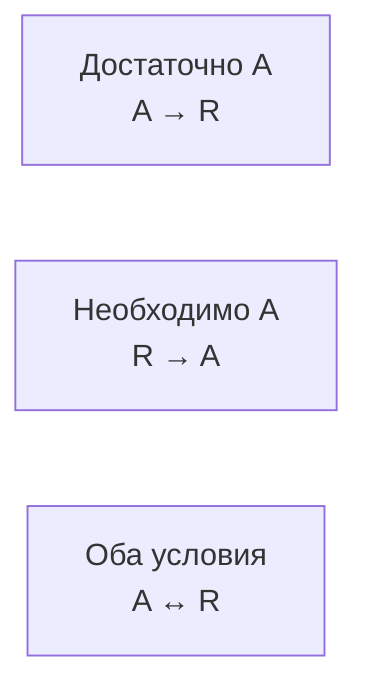

---
tags:
  - логика
  - обучение
lesson: 2
---

# 02. Как читать формулы и не переворачивать условия

Урок 2 из 12 · ориентир: 45–75 минут вместе с задачами.

← [Урок 1](01-reasoning.md) · [Оглавление](00-index.md) · [Урок 3](03-models.md) →

Перед началом: [урок 1](01-reasoning.md).

Символы нужны для точности. Здесь ты научишься читать ¬, ∧, ∨, → и ↔, а главное — различать достаточное и необходимое условие.

## В этом уроке

- [1. Словарь и синтаксис](#раздел-1)
- [2. Материальная импликация](#раздел-2)
- [3. Достаточное и необходимое](#раздел-3)
- [4. Включающее или и XOR](#раздел-4)
- [5. Эквивалентности как способ проверки](#раздел-5)
- [Задачи и самопроверка](#задачи-и-самопроверка)

## Раздел 1

### Словарь и синтаксис

Логика высказываний временно не анализирует внутреннее устройство фразы. Буква P обозначает целое утверждение. Один и тот же символ в пределах задачи сохраняет один смысл. Если P сначала означает «проверка запущена», а затем «проверка успешна», формула уже не представляет исходную задачу.

| Запись | Чтение | Когда истинна в классической логике |
| --- | --- | --- |
| ¬P | Не P | P ложно |
| P ∧ Q | P и Q | Оба истинны |
| P ∨ Q | P или Q | Хотя бы одно истинно, включая оба |
| P → Q | Если P, то Q | Во всех случаях, кроме P=1, Q=0 |
| P ↔ Q | P тогда и только тогда, когда Q | Значения P и Q совпадают |

Скобки задают структуру: ¬(P ∧ Q) отличается от (¬P ∧ Q). В учебных формулах лучше поставить лишние скобки, чем полагаться на неизвестный приоритет. Символ → внутри формулы и знак ⊨ между посылками и заключением обозначают разные вещи; второй появится в уроке 3.

## Раздел 2

### Материальная импликация

P → Q запрещает одну комбинацию: P истинно, а Q ложно. При ложном P условие истинно независимо от Q. Это не причинная теория и не инструкция «после P выполнить Q». Такая трактовка позволяет точно проверять логическое следование, но не кодирует время, причинность или вероятность.

«Если пакет одобрен, его можно выпустить» не обещает, что пакет когда-либо одобрят. А «если 2 нечётно, то 7 чётно» истинно как материальная импликация из-за ложной посылки; арифметической или причинной связи между частями оно не устанавливает.

> [!note]
> **Перевод — отдельное решение.** Обычное «если» иногда выражает причинную зависимость, контрфактическое условие или правило с исключениями. Не заменяй любое такое предложение материальной импликацией автоматически.

## Раздел 3

### Достаточное и необходимое

Пусть A — одобрение, R — разрешённый выпуск. «Одобрения достаточно для выпуска» означает A → R. «Одобрение необходимо для выпуска» означает R → A. В первом случае A гарантирует R в модели; во втором R невозможно без A, но одного A может быть мало.

«Выпуск разрешён только если есть одобрение» переводится R → A. «Выпуск разрешён если есть одобрение» — A → R. Если автор утверждает оба направления, получится R ↔ A. Слово «только» способно полностью изменить зависимость.

*Три разных контракта; стрелки внутри карточек показывают направление условия; переходов между карточками нет.*

## Раздел 4

### Включающее или и XOR

Обычное логическое ∨ допускает совместность. XOR означает «ровно одно»: (P ∨ Q) ∧ ¬(P ∧ Q). Для резервных каналов «доступен первый или второй» часто допускает оба. «Выбрана ровно одна активная конфигурация» требует исключения совместности.

Фраза «не обязательно оба» не равна «оба запрещены». Первая не утверждает обязательную совместность; вторая исключает её. Если текст неоднозначен, запиши варианты и вопрос к автору. Выбор формулы по желаемому ответу уничтожает независимость проверки.

## Раздел 5

### Эквивалентности как способ проверки

Для классической логики P → Q эквивалентно ¬P ∨ Q. Контрапозиция P → Q эквивалентна ¬Q → ¬P. Но обратное Q → P и инверсия ¬P → ¬Q в общем случае не эквивалентны исходному условию. Эквивалентности можно проверить четырьмя строками таблицы истинности.

Законы де Моргана: ¬(P ∧ Q) ↔ (¬P ∨ ¬Q) и ¬(P ∨ Q) ↔ (¬P ∧ ¬Q). «Не оба» означает хотя бы одно отрицание. «Ни одного» означает оба отрицания. Не переносим автоматически эти преобразования на произвольный оператор отрицания в программном языке.

## Задачи и самопроверка

Сначала запиши свой ответ. Затем раскрой разбор и сравни именно ход решения.

### Задача 1

Переведи: «Доступ даётся только если пароль верен»; «Верного пароля достаточно для доступа». D — доступ, P — верный пароль.

> [!answer]- Разбор
> Первая фраза: D → P. Вторая: P → D. В первой могут существовать дополнительные необходимые условия, например второй фактор.

### Задача 2

Можно ли заменить «P или Q, возможно оба» на XOR? Найди различающую оценку.

> [!answer]- Разбор
> Нельзя. При P=1 и Q=1 включающее или истинно, XOR ложно. Эта одна строка уже опровергает эквивалентность.

Дополнительная практика: [задание 2](13-practice.md#задание-2).

## Что теперь должно получаться

- [ ] Необходимое условие и достаточное направлены по-разному.
- [ ] Материальная импликация не кодирует причинность.
- [ ] XOR требует явного запрета совместности.

## Источники и дальнейшее чтение

- [forall x: Calgary — авторский открытый учебник; определения и системы доказательства](https://forallx.openlogicproject.org/html/)

Определения сверены по указанным источникам. Примеры, вычисления и задачи составлены для этого курса; это не перевод учебника.

← [Урок 1](01-reasoning.md) · [Оглавление](00-index.md) · [Урок 3](03-models.md) →
