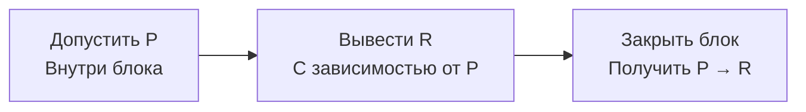

---
tags:
  - логика
  - обучение
lesson: 4
---

# 04. Доказательство: правила и область предположений

Урок 4 из 12 · ориентир: 45–75 минут вместе с задачами.

← [Урок 3](03-models.md) · [Оглавление](00-index.md) · [Урок 5](05-quantifiers.md) →

Перед началом: [урок 3](03-models.md).

Таблица перебирает модели, а доказательство строит разрешённые переходы. Ты научишься читать короткие выводы и понимать, что гарантируют корректность и полнота системы.

## В этом уроке

- [1. Семантика и синтаксический вывод](#раздел-1)
- [2. Правила, которые можно проверить по строкам](#раздел-2)
- [3. Полностью разобранный вывод](#раздел-3)
- [4. Как именно получается взрыв](#раздел-4)
- [5. Чего не гарантирует полнота](#раздел-5)
- [Задачи и самопроверка](#задачи-и-самопроверка)

## Раздел 1

### Семантика и синтаксический вывод

Запись Γ ⊨ Q относится к моделям. Запись Γ ⊢ Q означает: существует конечное доказательство Q из Γ по правилам выбранного исчисления. Символы похожи, но второй говорит о допустимой последовательности формальных шагов, а первый — об истинности во всех моделях.

Чтобы эти два подхода совпадали, нужна метатеория. **Корректность исчисления**: если Γ ⊢ Q, то Γ ⊨ Q. **Полнота**: если Γ ⊨ Q, то Γ ⊢ Q. Это свойства относительно конкретной логики и конкретной системы правил. Здесь мы используем обычное классическое натуральное исчисление.

## Раздел 2

### Правила, которые можно проверить по строкам

| Правило | Что имеется | Что разрешено |
| --- | --- | --- |
| Устранение →, modus ponens | P и P → Q | Q |
| Введение ∧ | P и Q | P ∧ Q |
| Устранение ∧ | P ∧ Q | P; отдельно Q |
| Введение ∨ | P | P ∨ Q |
| Устранение противоречия | ⊥ | Любая формула в классическом исчислении |

Каждая строка доказательства должна ссылаться на посылку, временное предположение или более ранние строки и правило. Фраза «очевидно» не заменяет шаг, который пока непонятен. В то же время доказательство не обязано повторять весь разговор или психологический ход поиска.

## Раздел 3

### Полностью разобранный вывод

```text
Посылки: P → Q, Q → R. Докажем P → R.
1. P → Q       посылка
2. Q → R       посылка
3. | P         временное предположение
4. | Q         →-устранение, 1 и 3
5. | R         →-устранение, 2 и 4
6. P → R       →-введение, закрываем блок 3–5
```

Мы не установили P как факт. Мы показали: если временно допустить P, получится R. После закрытия блока наружу выходит условие P → R, а не P или R. Эта дисциплина области предположений непосредственно связана с контрфактическими ветками агента: условный вывод не должен становиться безусловной памятью.



*Снятие предположения сохраняет условность вывода в форме импликации.*

## Раздел 4

### Как именно получается взрыв

```text
Посылки: P, ¬P. Цель: Q.
1. P       посылка
2. ¬P      посылка
3. P ∨ Q   введение ∨ из 1
4. | P     первая ветвь разбора дизъюнкции
5. | ⊥     противоречие 2 и 4
6. | Q     устранение ⊥
7. | Q     вторая ветвь разбора дизъюнкции
8. Q       устранение ∨: 3, блок 4–6 и блок 7
```

Более коротко: P и ¬P дают ⊥, из ⊥ следует Q. Взрыв не означает, что испорченная база стала всеведущей. Он означает, что классическая связь следования не предназначена сохранять различия заключений внутри противоречивого набора. Отказ от взрыва требует другой логики, а не просто удаления неприятной строки из произвольного доказательства.

## Раздел 5

### Чего не гарантирует полнота

Семантическая полнота не обещает, что конкретная программа найдёт доказательство за секунду. Для классической логики первого порядка существуют полные исчисления, но нет общего алгоритма, который всегда завершает проверку логической общезначимости произвольной формулы с ответом да или нет. Полнота исчисления и разрешимость задачи — разные свойства.

Также полнота не означает полноты сведений о мире. Даже совершенный доказатель способен вывести лишь следствия своей теории. Удобная проверка: после слов «полный» или «корректный» допиши, о чём именно речь — об исчислении, поиске, наборе данных или переводе исходного текста.

## Задачи и самопроверка

Сначала запиши свой ответ. Затем раскрой разбор и сравни именно ход решения.

### Задача 1

Из P ∧ Q и Q → R построй вывод P ∧ R.

> [!answer]- Разбор
> Сначала получи P и Q двумя применениями устранения ∧. Затем R из Q и Q → R. Последний шаг — введение ∧ для P и R.

### Задача 2

В ветви сна допустили P и получили R. Можно ли после выхода записать R в принятую память?

> [!answer]- Разбор
> Из одного такого вывода — нет. Он устанавливает зависимость R от P в этой ветви. Для безусловного R нужно независимо обосновать P либо найти доказательство без этого предположения.

Дополнительная практика: [задание 4](13-practice.md#задание-4).

## Что теперь должно получаться

- [ ] ⊨ говорит о моделях, ⊢ — о доказательстве.
- [ ] Временное предположение имеет область действия.
- [ ] Полнота исчисления не гарантирует завершение конкретного поиска.

## Источники и дальнейшее чтение

- [forall x: Calgary — авторский открытый учебник; определения и системы доказательства](https://forallx.openlogicproject.org/html/)

Определения сверены по указанным источникам. Примеры, вычисления и задачи составлены для этого курса; это не перевод учебника.

← [Урок 3](03-models.md) · [Оглавление](00-index.md) · [Урок 5](05-quantifiers.md) →
