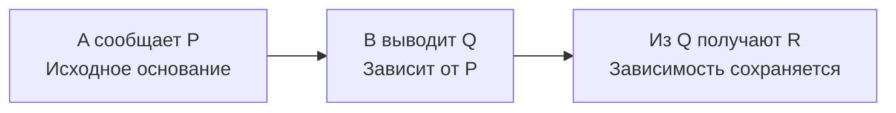

---
tags:
  - логика
  - обучение
lesson: 10
---

# 10. Аргументы, атаки и происхождение оснований

Урок 10 из 12 · ориентир: 45–75 минут вместе с задачами.

← [Урок 9](09-inconsistency.md) · [Оглавление](00-index.md) · [Урок 11](11-revision.md) →

Перед началом: [урок 9](09-inconsistency.md).

У двух доказательств может быть одно заключение и разные основания. Здесь мы отделим утверждение от аргумента и научимся считать небольшой граф атак вручную.

## В этом уроке

- [1. Пропозиция не равна аргументу](#раздел-1)
- [2. Абстрактная модель Дунга](#раздел-2)
- [3. Полный расчёт графа](#раздел-3)
- [4. Зависимость, пересказ и новое наблюдение](#раздел-4)
- [5. Что модель атак оставляет открытым](#раздел-5)
- [Задачи и самопроверка](#задачи-и-самопроверка)

## Раздел 1

### Пропозиция не равна аргументу

Пропозиция R — содержание утверждения. Аргумент включает основания и способ перехода к R. При a:P, u:P → R и b:Q, v:Q → R имеются D1=(a,u) и D2=(b,v). Оспаривание a касается D1, но само по себе не касается b. Два аргумента не обязаны исчезать вместе только из-за общего заключения.

Чтобы обсуждать независимость, уточни её вид. Логические пути могут иметь разные фактические корни, но общее правило. Два автора могут повторять один отчёт. Вероятностная независимость событий вообще требует отдельной вероятностной модели. Различные имена источников не доказывают ни одного из этих свойств автоматически.

## Раздел 2

### Абстрактная модель Дунга

В абстрактной аргументации задано множество аргументов A и отношение атак →. Здесь стрелка означает атаку, не материальную импликацию. Набор S бесконфликтен, если внутри него нет атак. S защищает аргумент a, если для каждого атакующего a аргумента b некоторый аргумент из S атакует b. Допустимый, admissible, набор бесконфликтен и защищает каждого своего члена.

В grounded-семантике ищут наименьшую неподвижную точку функции F(S), возвращающей аргументы, защищённые S. Для конечного графа её можно найти, начиная с пустого множества и повторяя F. Эти определения относятся к уже построенному графу; модель сама не извлекает смысл сообщений и не решает, какая текстовая реплика является атакой.

## Раздел 3

### Полный расчёт графа

```text
Аргументы: a, b, c.
Атаки: a → b, b → a, c → b.

S0 = ∅
F(S0) = {c}: только у c нет атакующих.
F({c}) = {a,c}: c атакует b, единственного атакующего a.
F({a,c}) = {a,c}: новых защищённых аргументов нет.
```

Grounded-расширение — {a,c}. Набор не содержит атак между своими членами. Он защищает a от b, а c защищать не от кого. Аргумент b не защищён: его атакует c, но никто не атакует c. Получился результат, который можно проверить по каждому ребру.

Если оставить только взаимные атаки a ↔ b, grounded-расширение пусто. При этом {a} и {b} — разные максимально по включению допустимые, то есть preferred-расширения. Выбор семантики влияет на принятие; слова «есть аргумент» недостаточно.

## Раздел 4

### Зависимость, пересказ и новое наблюдение

Пусть B получил Q только из сообщения A:P по правилу P → Q. Тогда путь B к R всё ещё опирается на A:P. Если система сохраняет Q как новый беспричинный корень, она стирает зависимость. После оспаривания P такой корень может ошибочно выглядеть независимым.

Но если B действительно наблюдал Q отдельно, новое основание имеется. Поэтому для каждого поддерживающего элемента нужно различать наблюдение, пересказ и вывод. Запись связи происхождения должна участвовать в проверке допустимости или управлять пересмотром; красивого отображения истории недостаточно.



*Передача заключения другому автору сама по себе не создаёт нового корня свидетельства.*

## Раздел 5

### Что модель атак оставляет открытым

Нельзя просто назвать два противоположных текста a и b и считать граф завершённым. Нужно определить, атакуют ли они заключения, посылки или применимость правила. Нужно сохранить время и смысл предикатов. «Не P вчера» и «P сегодня» не образуют прямой конфликт без дополнительного временного допущения.

Для теории агента полезен минимальный договор: какая запись образует аргумент, от чего он зависит, что считается атакой и какая семантика принятия выбрана. Затем отдельно определяется действие. Абстрактная аргументация помогает сделать эти вопросы явными; она не заменяет обоснование самого договора.

## Задачи и самопроверка

Сначала запиши свой ответ. Затем раскрой разбор и сравни именно ход решения.

### Задача 1

В графе a → b → c без других рёбер вычисли grounded-расширение.

> [!answer]- Разбор
> F(∅)={a}. Затем a атакует b, единственного атакующего c, поэтому F({a})={a,c}. Это неподвижная точка. b не защищён от a.

### Задача 2

A опубликовал P. B и C дословно процитировали A. Получили ли мы три независимых свидетельства?

> [!answer]- Разбор
> Нет оснований так считать. Есть три сообщения с одним общим источником содержания. Новое независимое свидетельство требует дополнительного наблюдения или иной самостоятельной опоры, а не нового автора цитаты.

Дополнительная практика: [задание 10](13-practice.md#задание-10).

## Что теперь должно получаться

- [ ] Аргумент хранит путь обоснования, а не только заключение.
- [ ] Атака, защита и принятие требуют точных определений.
- [ ] Пересказ не создаёт независимость свидетельств.

## Источники и дальнейшее чтение

- [Phan Minh Dung (1995) — оригинальная статья о допустимости и grounded-семантике](https://cse-robotics.engr.tamu.edu/dshell/cs631/papers/dung95acceptability.pdf)

Определения сверены по указанным источникам. Примеры, вычисления и задачи составлены для этого курса; это не перевод учебника.

← [Урок 9](09-inconsistency.md) · [Оглавление](00-index.md) · [Урок 11](11-revision.md) →
