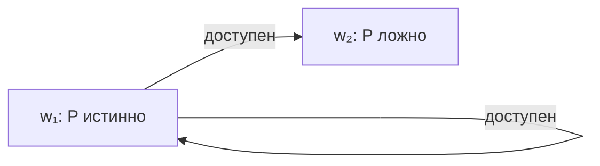

---
tags:
  - логика
  - обучение
lesson: 12
---

# 12. Знание, убеждение и проверка собственной теории

Урок 12 из 12 · ориентир: 45–75 минут вместе с задачами.

← [Урок 11](11-revision.md) · [Оглавление](00-index.md) · [Практикум](13-practice.md) →

Перед началом: [урок 11](11-revision.md).

Последний урок собирает маршрут: что означает «агент знает», как отличить модель знания от журнала и как сформулировать проверяемое положение собственной теории.

## В этом уроке

- [1. Оператор знания — новое утверждение](#раздел-1)
- [2. Маленькая модель возможных миров](#раздел-2)
- [3. Идеализация и ограниченный агент](#раздел-3)
- [4. Как проверить положение своей теории](#раздел-4)
- [5. Шаблон исследовательской заметки](#раздел-5)
- [Задачи и самопроверка](#задачи-и-самопроверка)

## Раздел 1

### Оператор знания — новое утверждение

Запись KₐP читается «агент a знает P». Она не равна P: мир может быть устроен определённым образом, а агент этого не знать. Запись BₐP для убеждения тоже не равна KₐP. В стандартной фактивной трактовке знания принимается KₐP → P; убеждение обычно не требует такой гарантии.

Если приложение называет все принятые сообщения «знаниями», из этого не возникает фактивность. Название таблицы knowledge ничего не говорит об истинности её строк. Можно выбрать более слабую семантику принятия, но тогда это надо написать явно.

## Раздел 2

### Маленькая модель возможных миров

Пусть w₁ и w₂ — два мира, которые агент ещё считает возможными. В w₁ P истинно, в w₂ ложно. Определим KₐP в мире w как истинность P во всех мирах, доступных агенту из w. Если из w₁ доступны оба мира, KₐP ложно и Kₐ¬P тоже ложно.

Даже если действительный мир w₁ и P в нём истинно, агент пока не знает P: его доступные альтернативы включают w₂. Фактивность гарантируется, например, рефлексивностью доступности: действительный мир обязательно среди проверяемых альтернатив. Без такого условия смысл оператора другой.



*Различие миров объясняет незнание без третьего истинностного значения внутри каждого мира.*

## Раздел 3

### Идеализация и ограниченный агент

Семантика «во всех доступных мирах» идеализирует познающего: она замыкает знание относительно логических следствий доступных возможностей. Реальная программа может не успеть вычислить следствие, забыть сведения или неправильно разобрать текст. Модель ограниченного вычисления должна отдельно описывать эти различия.

Таймаут — факт о ходе вычисления. Unknown может означать отсутствие достаточных оснований в завершённом анализе. False в Prolog — конечный неуспех данного запроса. ¬KₐP — незнание в модальной модели. Это четыре разных конструкции. Общее русское слово «не знает» не делает их взаимозаменяемыми.

## Раздел 4

### Как проверить положение своей теории

Начни с точной фразы: «Если у R есть аргумент, не зависящий от оспоренных оснований, то этот аргумент сохраняется после оспаривания другого основания». Затем уточни: сохраняется существование дерева, его допустимость, статус R или право действовать? Условия и вывод должны говорить об одном уровне.

Построй минимальную модель, в которой посылка тезиса выполнена, а заключение предположительно нарушено. Например, у R есть чистый путь Q → R; отдельное спорное P через P → ¬R создаёт raw-конфликт. Если процедура блокирует действие, это ещё не опровергает существование чистого аргумента. Но может опровергнуть более сильный тезис о безусловном разрешении действия.

Далее отдели три вопроса: выводится ли свойство из определения? Реализует ли код это определение? Полезно ли выбранное свойство для задач агента? Для первого нужен математический разбор, для второго — проверка реализации, для третьего — содержательный критерий и соответствующий эксперимент.

## Раздел 5

### Шаблон исследовательской заметки

```text
1. Положение: что именно утверждается?
2. Объекты: формулы, сообщения, аргументы, источники, действия.
3. Семантика: что значат вывод, конфликт и допустимость?
4. Предпосылки: область, время, полнота, доверие.
5. Минимальный положительный пример.
6. Возможный контрпример.
7. Расчёт по определению до запуска кода.
8. Расхождение: тезис, определение, реализация или данные?
9. Исправление и цена: какое желаемое свойство теряем?
```

Сравнение с существующими подходами нужно вести по этим пунктам. Наличие похожих идей не делает проект бессмысленным; отсутствие сравнения не делает его новым. После курса можно читать исходные работы об аргументации и пересмотре убеждений, понимая, какие определения искать.

Следующий самостоятельный шаг — итоговый практикум. В нём не нужно защищать проект любой ценой или придумать новую логику. Нужно показать точное место, где два выбранных требования совместимы, конфликтуют или пока недостаточно определены.

## Задачи и самопроверка

Сначала запиши свой ответ. Затем раскрой разбор и сравни именно ход решения.

### Задача 1

В действительном w₁ P истинно, но агент допускает w₂ с ложным P. Следует ли из истинности P знание KₐP?

> [!answer]- Разбор
> Нет. По заданной семантике P должно быть истинно во всех доступных мирах. w₂ служит контрпримером к KₐP, хотя не делает P ложным в действительном w₁.

### Задача 2

Теория обещает сохранение чистого аргумента; тест проверяет только act/pause. Достаточен ли такой тест?

> [!answer]- Разбор
> Нет: действие зависит ещё от политики, бюджета и обязательств. Нужно наблюдать объект обещанного свойства — аргумент и его статус — либо явно включить переход от него к действию в проверяемый тезис.

Дополнительная практика: [задание 12](13-practice.md#задание-12).

## Что теперь должно получаться

- [ ] Знание, убеждение, принятая запись и истина не тождественны.
- [ ] Тезис проверяют на том уровне, на котором он сформулирован.
- [ ] Контрпример помогает уточнить теорию; ошибка кода не автоматически опровергает её.

## Источники и дальнейшее чтение

- [van Ditmarsch, Halpern, van der Hoek, Kooi (2015) — авторское введение в логику знания и убеждения](https://www.cs.cornell.edu/info/people/halpern/papers/handbook-intro.pdf)
- [Phan Minh Dung (1995) — оригинальная статья о допустимости и grounded-семантике](https://cse-robotics.engr.tamu.edu/dshell/cs631/papers/dung95acceptability.pdf)
- [Alchourrón, Gärdenfors, Makinson (1985) — оригинальная статья о contraction и revision](https://fitelson.org/piksi/piksi_22/agm.pdf)

Определения сверены по указанным источникам. Примеры, вычисления и задачи составлены для этого курса; это не перевод учебника.

← [Урок 11](11-revision.md) · [Оглавление](00-index.md) · [Практикум](13-practice.md) →
